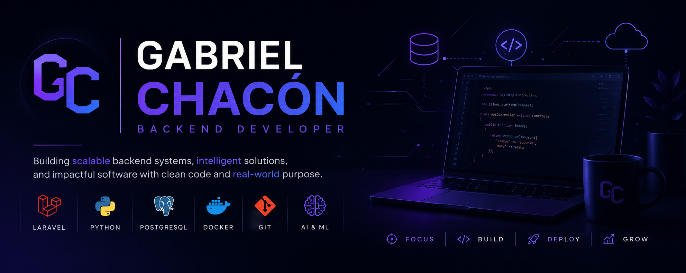

# Hello there!

  

### Backend Developer | Computer Systems Engineering Student

Building scalable backend systems, databases, APIs, and AI-powered solutions.

  
  

---

# About

I'm Gabriel Chacón, a Computer Systems Engineering student passionate about backend development, database engineering, software architecture, and artificial intelligence.

Currently, I serve as **Project Manager at IEEE**, where I coordinate engineering initiatives, identify technical talent, evaluate software projects, and promote collaboration within the Computer Systems Engineering community.

I enjoy building real-world software, learning new technologies, and designing scalable solutions.

# Portfolio

https://gabriel-chacon-portfolio.onrender.com

---

# Experience

# Education

##  Instituto Tecnológico de Morelia

**Bachelor's Degree in Computer Systems Engineering**

Relevant Coursework

- Object-Oriented Programming
- Data Structures
- Database Systems
- Algorithms
- Software Engineering
- Operating Systems
- Computer Networks
- Web Development

---

##  Universidad Michoacana de San Nicolás de Hidalgo (UMSNH)

**English Language Training Program (9 Semesters)**

Comprehensive training in listening comprehension, speaking, reading, and academic writing.

Development of competencies for technical communication and documentation in English.

---

# Technical Skills

### Languages

  
  
  
  
  
  

### Backend

  
  
  

### Databases

  
  
  
  
  

### Tools

  
  
  
  
  

---

# Currently Learning

- Artificial Intelligence
- Computer Vision
- Cloud Computing
- Distributed Systems
- Software Architecture

---

# Courses & Certifications

## Udemy

- Java Programming Masterclass
- Python Data Structures & Algorithms
- Software Engineering
- SQL & NoSQL Databases
- Artificial Intelligence with Python
- Machine Learning & Data Science
- Blender 3D
- Cambridge C1 Exam Preparation

## Instituto Gestalt

- English Proficiency Certificate
- Business Administration Training

---

# Contact

---

> "Building software that solves real problems."
